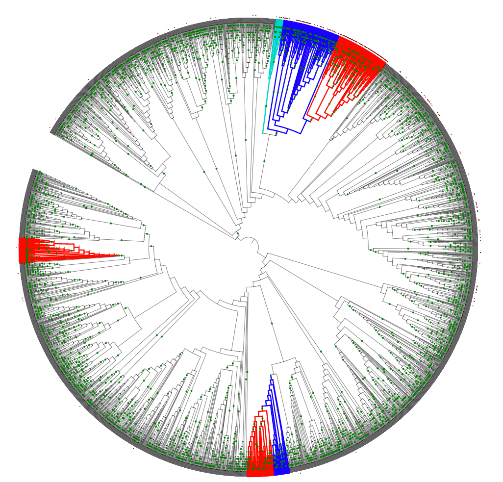
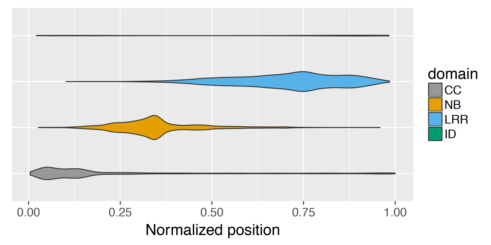
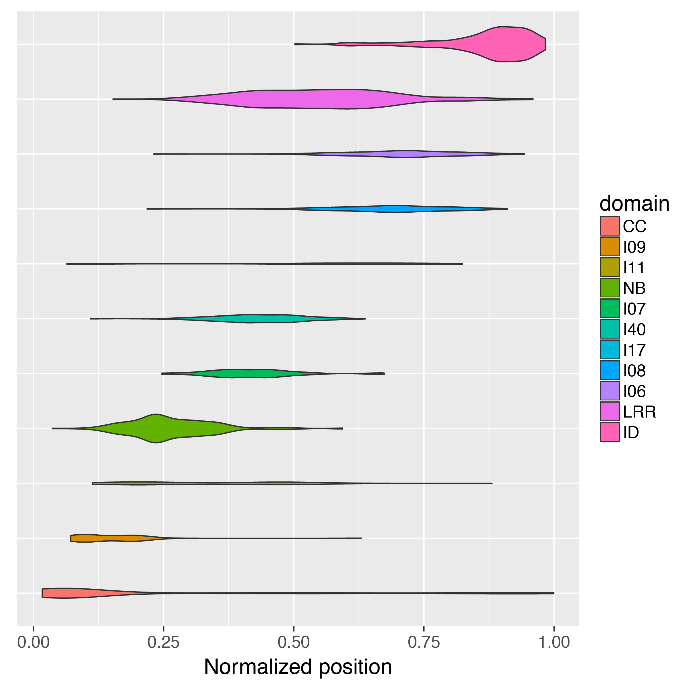
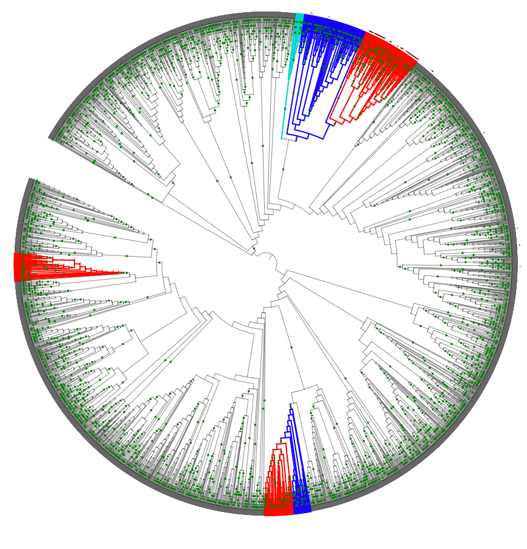
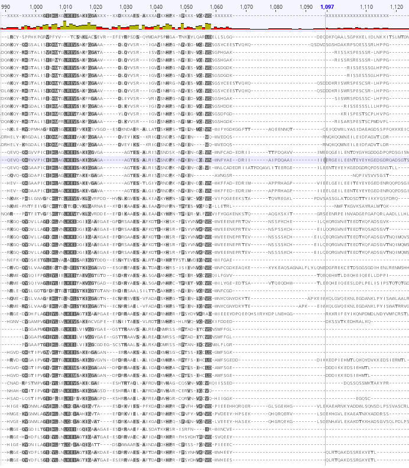
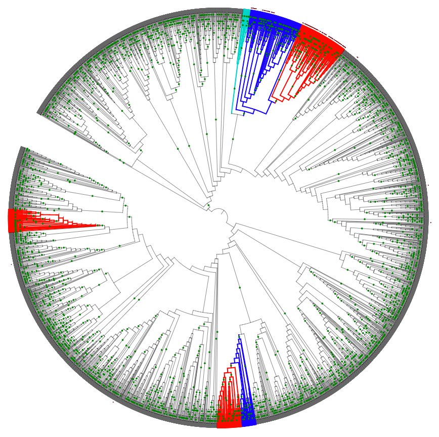
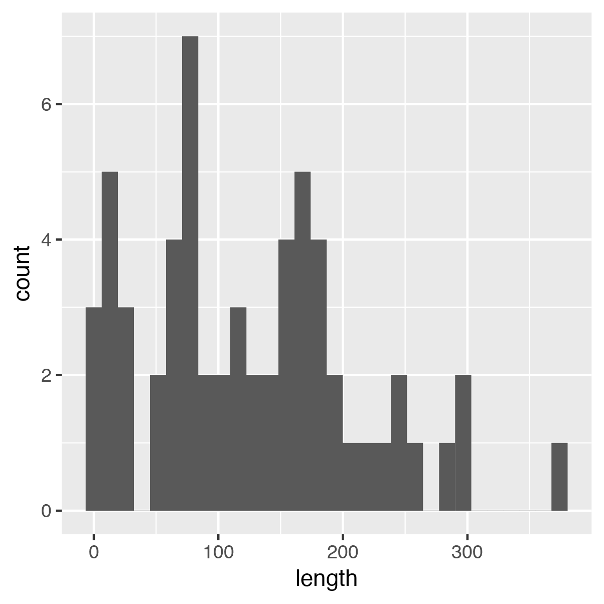

# NLR-ID_motif
Identification of protein motifs associated with NLRs harboring integrated domains

## Motif discovery in NLRs with integrated domains
The propensity of NLRs within the major integration clade to gain novel domains suggests that genetic novelty in the ancestors of this gene family accomodates the presence of exogeneous domains. We hypothesized that genetic novelty in the form of novel domains are associated with genes within this clade. Based on our existing annotation of known domains using `InterProScan`, we identifed all regions without an annotation by masking annotated regions. Next, we used `MEME` to identify conserved motifs, `FIMO` to search the entire grass NLRome, and generated a phylogenetic tree to identify motifs specifically assocated with the major integration clade.

### Identification of undefined regions within NLRs
NLRs within the MIC1 clade were annotated for known domains using InterProScan (v5.20-59.0).

```bash
interproscan.sh --applications SUPERFAMILY, Coils, ProSiteProfiles, ProSitePatterns, Pfam --output-dir . --input ID_subgroup_geneIds_inner_ID_group.pep.fasta --iprlookup --seqtype p
```

The [QKdomain](https://github.com/matthewmoscou/QKdomain) pipeline was used to annotate domains and extract undefined regions within NLRs.

```bash
python QKdomain_process.py ID_subgroup_geneIds_inner_ID_group.pep.fasta ID_subgroup_geneIds_inner_ID_group.pep.fasta.tsv ALL_trinity_assembly_v3_pep_NLRs_plus_9GrassKK_abbreviations.txt ID_subgroup_geneIds_inner_ID_group.pep_preprocess_summary.txt --undefined ID_subgroup_geneIds_inner_ID_group.undefined.pep.fasta
```

A requirement was made that all undefined regions be at least 20 amino acids in length.

### Identification of novel motifs 
We used `MEME` for motif prediction using the undefined regions within NLRs with integrated domains.

```bash
meme ID_subgroup_geneIds_inner_ID_group.undefined.min20.pep.fasta -protein -mod zoops -nmotifs 40 -maxsize 120000
```

To identify motifs that are specifically associated with the MIC1 clade, we used `FIMO` to annotate the entire set of NLRs from diverse grass species. `FIMO` output was parsed using `parse_fimo_data.py`, which formats the `FIMO` output in InterProScan and iTOL output.

```bash
fimo inner_meme.txt full_length_seqs_of_phylo_geneIds.fasta
python parse_fimo_data.py
```

Next, we looked for phylogenetic signatures for saturation within the MIC1 clade. We identified seven motifs, I06, I07, I08, I09, I11, I17, I40, that were saturated within the MIC1 clade. In some cases, this included regions outside of the MIC1 clade including the outer and ancestral group.



### Distribution of novel motifs in NLRs
To investigate the position of these motifs within NLRs, we used a customized `QKdomain` pipeline to identify the normalized position of domains within NLRs. For every NLR, the length of the NLR was normalized to 1.0 and the mid-point of identified domains were normalized to protein length. Using this approach, we can observe the relative position of domains in NLRs. First, we concatenate the `FIMO` identified motifs with the previously curated CC, NB, LRR, and ID motif set. Next, we identified the domain structure of all NLRs. 

```bash
cat NLR_ID_FIMO_I* full_length_seqs_of_phylo_geneIds.fasta.tsv > NLR_ID_all.tsv

python QKdomain_process_NLR-ID_analysis.py full_length_seqs_of_phylo_geneIds.fasta NLR_ID_all.tsv full_length_seqs_of_phylo_geneIds_Coils_Pfam_annotation.txt NLR_ID_all_output.txt
```

To visualize the position of domains within NLRs, we use `ggplot2` in `R` to generate density plots of domain position within NLRs, including the identified ID-associated motifs.

```R
library(ggplot2)
cbPalette <- c("#999999", "#E69F00", "#56B4E9", "#009E73", "#F0E442", "#0072B2", "#D55E00", "#CC79A7")
scale_fill_manual(values=cbPalette)
setwd("~/Research/projects/NLR-ID_motif/data/")
theme_set(theme_gray(base_size = 18))

data = read.table(file="domain_position_noI.txt", header=T)
data = data.frame(data)
data$domain <- factor(data$domain, levels=c("CC","NB","LRR", "ID"))
ggplot(data, aes(factor(domain), position, fill=domain)) + geom_violin(scale="count") + scale_y_continuous(position = "left") + scale_fill_manual(values=cbPalette) + ylab("Normalized position") + theme(axis.title.y=element_blank(), axis.text.y=element_blank(), axis.ticks.y=element_blank()) + coord_flip()
ggsave("NLR_domain_distribution.ps", width=8, height=4)
```

First, we observe the relative position of CC, NB, LRR, and ID in all NLRs. Density plots (=violin plots) show the density of each domain scaled by the total number of NLRs. ID is difficult to see due to their lower frequency.



```R
data = read.table(file="domain_position_NLR_ID_noI.txt", header=T)
data = data.frame(data)
data$domain <- factor(data$domain, levels=c("CC","NB","LRR", "ID"))
ggplot(data, aes(factor(domain), position, fill=domain)) + geom_violin(scale="count") + scale_y_continuous(position = "left") + scale_fill_manual(values=cbPalette) + ylab("Normalized position") + theme(axis.title.y=element_blank(), axis.text.y=element_blank(), axis.ticks.y=element_blank()) + coord_flip()
ggsave("NLR-ID_domain_distribution.ps", width=8, height=4)
```

Next, we look only NLRs with ID. ID are either N or C terminal in the localization.


```R
data = read.table(file="domain_position_C.txt", header=T)
data = data.frame(data)
data$domain <- factor(data$domain, levels=c("CC","I09", "I11", "NB", "I07", "I40", "I17", "I08", "I06", "LRR", "ID"))
ggplot(data, aes(factor(domain), position, fill=domain)) + geom_violin(scale="count") + scale_y_continuous(position = "left") + ylab("Normalized position") + theme(axis.title.y=element_blank(), axis.text.y=element_blank(), axis.ticks.y=element_blank()) + coord_flip()
ggsave("NLR-ID_C_I_domain_distribution.ps", width=8, height=8)
```

Last, we evaluate the position of `MEME` motifs relative to known domains. We found that I09 and I11 are localized to the N-terminal regions between CC and NB, whereas I07, I40, I17, I08, and I06 are associated with the LRR region and/or between the LRR and ID.



### Investigation of overlap between motifs and known domains
Motifs I09 and I11 are associated with the N-terminal region of NLRs with ID. I09 is more widespread (59 occurrences in NLR-ID), whereas I11 occurs in 45 NLR-ID. When found together, they are always found in tandem (I09-I11) and precede the NB domain. A modified instance of `QKdomain` was used to extract NLRs with the I09-I11 motif and a Hidden Markov Model (HMM) was generated. Next, we used this HMM to scan all NLRs. A clear association was found with NLRs in the MIC1 clade.

```bash
python QKdomain_process_NLR-ID_analysis.py full_length_seqs_of_phylo_geneIds.fasta NLR_ID_all.tsv full_length_seqs_of_phylo_geneIds_Coils_Pfam_annotation.txt NLR_ID_all_output.txt domains_I09-I11.fa -d I09-I11
```

We performed multiple sequence alignment using MUSCLE (v3.8.31) and used the alignment to train a HMM.

```bash
hmmsearch --pfamtblout I09_I11_scan_pfam.txt CID.hmm I09_I11.fa >  I09_I11_scan.txt
python parse_hmm_data.py
```


Next, we investigated motifs I06, I07, I08, I17, and I40, which are associated with the C-terminal region of NLR-ID. Using `grep` and `QKgenome`, we extracted all tandem arrays of these motifs starting with I40, which typically occured first among the motifs.

```bash
grep 'I[0-9][0-9]' NLR_ID_all_output.txt_NLR_ID > NLR_ID_all_output.txt_NLR_ID_I.txt
grep -o 'I40-[I0-9-]*-I[0-9][0-9]' NLR_ID_all_output.txt_NLR_ID_I.txt > NLR_ID_all_output.txt_NLR_ID_I_domain.txt
```

Next, we extracted sequence for all genes with the identified motifs using `QKgenome`.

```bash
python QKdomain_process_NLR-ID_analysis.py full_length_seqs_of_phylo_geneIds.fasta NLR_ID_all.tsv full_length_seqs_of_phylo_geneIds_Coils_Pfam_annotation.txt NLR_ID_all_output.txt domains_I40-I08-I06.fa -d I40-I08-I06
python QKdomain_process_NLR-ID_analysis.py full_length_seqs_of_phylo_geneIds.fasta NLR_ID_all.tsv full_length_seqs_of_phylo_geneIds_Coils_Pfam_annotation.txt NLR_ID_all_output.txt domains_I40-I06-I07-I08.fa -d I40-I06-I07-I08
python QKdomain_process_NLR-ID_analysis.py full_length_seqs_of_phylo_geneIds.fasta NLR_ID_all.tsv full_length_seqs_of_phylo_geneIds_Coils_Pfam_annotation.txt NLR_ID_all_output.txt domains_I40-I17-I07-I08-I06.fa -d I40-I17-I07-I08-I06
python QKdomain_process_NLR-ID_analysis.py full_length_seqs_of_phylo_geneIds.fasta NLR_ID_all.tsv full_length_seqs_of_phylo_geneIds_Coils_Pfam_annotation.txt NLR_ID_all_output.txt domains_I40-I07-I08-I06.fa -d I40-I07-I08-I06
python QKdomain_process_NLR-ID_analysis.py full_length_seqs_of_phylo_geneIds.fasta NLR_ID_all.tsv full_length_seqs_of_phylo_geneIds_Coils_Pfam_annotation.txt NLR_ID_all_output.txt domains_I40-I11-I07-I08-I06.fa -d I40-I11-I07-I08-I06
python QKdomain_process_NLR-ID_analysis.py full_length_seqs_of_phylo_geneIds.fasta NLR_ID_all.tsv full_length_seqs_of_phylo_geneIds_Coils_Pfam_annotation.txt NLR_ID_all_output.txt domains_I40-I08-I06-I06.fa -d I40-I08-I06-I06
python QKdomain_process_NLR-ID_analysis.py full_length_seqs_of_phylo_geneIds.fasta NLR_ID_all.tsv full_length_seqs_of_phylo_geneIds_Coils_Pfam_annotation.txt NLR_ID_all_output.txt domains_I40-I17-I07.fa -d I40-I17-I07
python QKdomain_process_NLR-ID_analysis.py full_length_seqs_of_phylo_geneIds.fasta NLR_ID_all.tsv full_length_seqs_of_phylo_geneIds_Coils_Pfam_annotation.txt NLR_ID_all_output.txt domains_I40-I11-I06-I07-I08.fa -d I40-I11-I06-I07-I08
python QKdomain_process_NLR-ID_analysis.py full_length_seqs_of_phylo_geneIds.fasta NLR_ID_all.tsv full_length_seqs_of_phylo_geneIds_Coils_Pfam_annotation.txt NLR_ID_all_output.txt domains_I40-I17-I06-I07-I08.fa -d I40-I17-I06-I07-I08
python QKdomain_process_NLR-ID_analysis.py full_length_seqs_of_phylo_geneIds.fasta NLR_ID_all.tsv full_length_seqs_of_phylo_geneIds_Coils_Pfam_annotation.txt NLR_ID_all_output.txt domains_I40-I17-I08-I06.fa -d I40-I17-I08-I06
python QKdomain_process_NLR-ID_analysis.py full_length_seqs_of_phylo_geneIds.fasta NLR_ID_all.tsv full_length_seqs_of_phylo_geneIds_Coils_Pfam_annotation.txt NLR_ID_all_output.txt domains_I40-I11-I08-I06.fa -d I40-I11-I08-I06
python QKdomain_process_NLR-ID_analysis.py full_length_seqs_of_phylo_geneIds.fasta NLR_ID_all.tsv full_length_seqs_of_phylo_geneIds_Coils_Pfam_annotation.txt NLR_ID_all_output.txt domains_I40-I17-I06-I08.fa -d I40-I17-I06-I08
python QKdomain_process_NLR-ID_analysis.py full_length_seqs_of_phylo_geneIds.fasta NLR_ID_all.tsv full_length_seqs_of_phylo_geneIds_Coils_Pfam_annotation.txt NLR_ID_all_output.txt domains_I40-I11-I07-I06-I08.fa -d I40-I11-I07-I06-I08
python QKdomain_process_NLR-ID_analysis.py full_length_seqs_of_phylo_geneIds.fasta NLR_ID_all.tsv full_length_seqs_of_phylo_geneIds_Coils_Pfam_annotation.txt NLR_ID_all_output.txt domains_I40-I07-I08.fa -d I40-I07-I08
python QKdomain_process_NLR-ID_analysis.py full_length_seqs_of_phylo_geneIds.fasta NLR_ID_all.tsv full_length_seqs_of_phylo_geneIds_Coils_Pfam_annotation.txt NLR_ID_all_output.txt domains_I40-I17-I11-I07-I08-I06.fa -d I40-I17-I11-I07-I08-I06
python QKdomain_process_NLR-ID_analysis.py full_length_seqs_of_phylo_geneIds.fasta NLR_ID_all.tsv full_length_seqs_of_phylo_geneIds_Coils_Pfam_annotation.txt NLR_ID_all_output.txt domains_I40-I06-I08.fa -d I40-I06-I08
python QKdomain_process_NLR-ID_analysis.py full_length_seqs_of_phylo_geneIds.fasta NLR_ID_all.tsv full_length_seqs_of_phylo_geneIds_Coils_Pfam_annotation.txt NLR_ID_all_output.txt domains_I40-I11-I06-I08.fa -d I40-I11-I06-I08
python QKdomain_process_NLR-ID_analysis.py full_length_seqs_of_phylo_geneIds.fasta NLR_ID_all.tsv full_length_seqs_of_phylo_geneIds_Coils_Pfam_annotation.txt NLR_ID_all_output.txt domains_I40-I17-I11-I06-I07-I08.fa -d I40-I17-I11-I06-I07-I08
python QKdomain_process_NLR-ID_analysis.py full_length_seqs_of_phylo_geneIds.fasta NLR_ID_all.tsv full_length_seqs_of_phylo_geneIds_Coils_Pfam_annotation.txt NLR_ID_all_output.txt domains_I40-I07-I06-I08.fa -d I40-I07-I06-I08
python QKdomain_process_NLR-ID_analysis.py full_length_seqs_of_phylo_geneIds.fasta NLR_ID_all.tsv full_length_seqs_of_phylo_geneIds_Coils_Pfam_annotation.txt NLR_ID_all_output.txt domains_I40-I17-I08-I06-I09.fa -d I40-I17-I08-I06-I09
python QKdomain_process_NLR-ID_analysis.py full_length_seqs_of_phylo_geneIds.fasta NLR_ID_all.tsv full_length_seqs_of_phylo_geneIds_Coils_Pfam_annotation.txt NLR_ID_all_output.txt domains_I40-I17-I07-I08.fa -d I40-I17-I07-I08
python QKdomain_process_NLR-ID_analysis.py full_length_seqs_of_phylo_geneIds.fasta NLR_ID_all.tsv full_length_seqs_of_phylo_geneIds_Coils_Pfam_annotation.txt NLR_ID_all_output.txt domains_I40-I17-I08.fa -d I40-I17-I08
```

Multiple sequence alignment of these regions found that motifs I07, I08, I17, and I40 are LRR-specific motifs, which are trained on LRRs that commonly occur in NLRs within the MIC1 clade. In contrast, I06 was not associated with LRRs. Further inspection of this motif found that it precedes the presence of an ID. We designated all integrated domains with the abbreviation 'ID' and used `QKdomain` to extract all sequences between and including I06-ID.

```bash
python QKdomain_process_NLR-ID_analysis.py full_length_seqs_of_phylo_geneIds.fasta NLR_ID_all.tsv full_length_seqs_of_phylo_geneIds_Coils_Pfam_annotation_ID.txt NLR_ID_all_output_ID.txt domains_I06-ID.fa -n 100 -d I06-ID
```

Multiple sequence alignment of the region flanked by I06 and the ID found a clear breakpoint in the alignment of NLRs with ID. This suggests that the I06 motif is retained after integration of an ID and may play a role in its function.



We trained a HMM on the conserved sequence surrounding I06 and used the HMM to search the entire NLR dataset.

```bash
hmmbuild CID.hmm NLR-ID_Cterm_preID.fa
hmmsearch --pfamtblout CID_NLR_scan_pfam.txt CID.hmm ../full_length_seqs_of_phylo_geneIds.fasta > CID_NLR_scan.txt
python parse_hmm_data.py
```

Overlay on the phylogenetic tree found strong association with the MIC1 clade and related NLRs.



We designated this domain the CID domain. Next, we extracted all sequence between and including the CID-ID.

```bash
cat full_length_seqs_of_phylo_geneIds.fasta.tsv CID_NLR_scan_pfam.tsv > NLR_ID_CID.tsv
python QKdomain_process_NLR-ID_analysis.py full_length_seqs_of_phylo_geneIds.fasta NLR_ID_CID.tsv full_length_seqs_of_phylo_geneIds_Coils_Pfam_annotation_ID_CID.txt NLR_ID_all_output.txt -d CID-ID NLR_ID_all_CID-ID.fa
hmmsearch --pfamtblout NLR_CID-ID_scan_pfam.txt CID.hmm ../NLR_ID_all_CID-ID.fa >  NLR_CID-ID_scan.txt
python parse_hmm_data.py

cat NLR_ID_all_CID-ID.fa.tsv NLR_CID-ID_scan_pfam.tsv > NLR_ID_all_CID-ID_all.tsv
python QKdomain_process_NLR-ID_analysis.py NLR_ID_all_CID-ID.fa NLR_ID_all_CID-ID_all.tsv full_length_seqs_of_phylo_geneIds_Coils_Pfam_annotation_ID_CID.txt NLR_CID-ID_all_output.txt -u the_spaces_in_between.fa

python parse_fasta_length.py the_spaces_in_between.fa > the_spaces_in_between_length.txt
```

Using this approach, we could identify the average linker space between NLRs and ID.

```R
library(ggplot2)

setwd("~/Desktop/bioinformatics/NLRome/NLR_annotation_cufflinks_clustering_MM9/11_grasses_NLR-ID_KK/")
data = read.table(file="the_spaces_in_between_length.txt", header=T)
data = data.frame(data)

ggplot(data, aes(length)) + geom_histogram()
```


